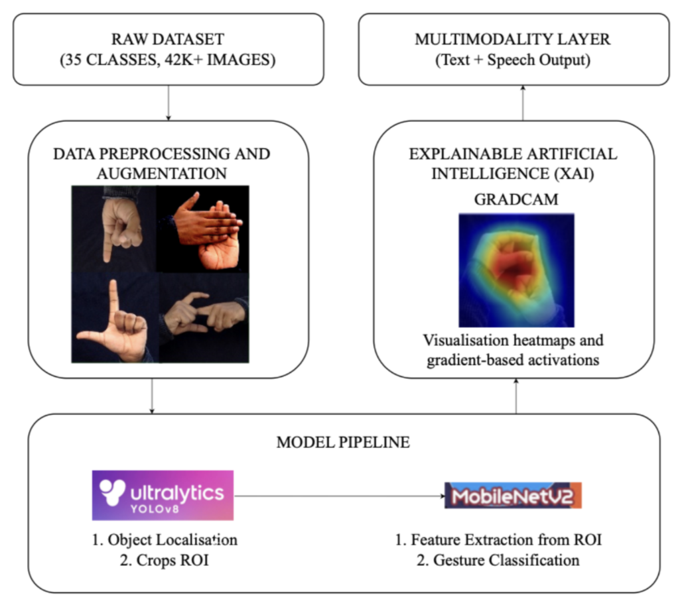
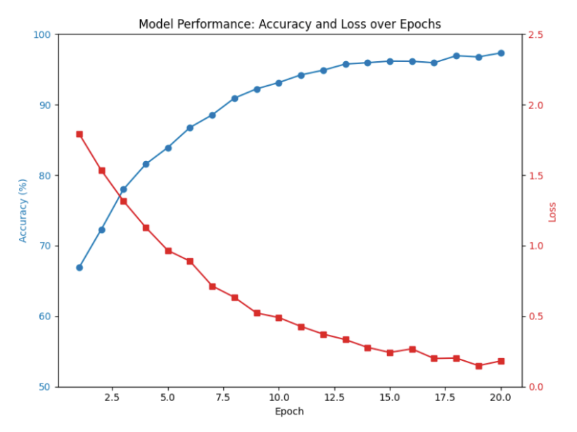

# Indian Sign Language (ISL) Recognition System

## Overview
This project presents a **real-time, multimodal, and explainable Indian Sign Language (ISL) recognition system** that bridges communication gaps between sign language users and non-signers.

The system combines **YOLOv8** for hand detection, **MobileNetV2** for lightweight gesture classification, **Grad-CAM** for explainability, and **Text-to-Speech (TTS)** for audio output. It supports both **live webcam** and **recorded video** inputs.

---

## Project Workflow
The overall pipeline of the proposed system is shown below:

**Pipeline:**  
Input Video → YOLOv8 Hand Detection → ROI Extraction → MobileNetV2 Classification → Grad-CAM Explainability → Text & Speech Output

---

## ISL Recognition Results
Sample output demonstrating detection, classification, and explainability:

The output includes bounding boxes, predicted gesture labels, Grad-CAM heatmaps, and real-time text-to-speech feedback.

---

## Key Features
- Real-time hand detection using YOLOv8  
- Efficient gesture classification with MobileNetV2  
- 35 ISL classes (Alphabets A–Z, Numerals 1–9)  
- Explainable AI using Grad-CAM  
- Text-to-Speech conversion for accessibility  
- Optimized for real-time and edge deployment  

---

## Models Used
- **YOLOv8:** COCO-pretrained, fine-tuned for hand detection  
- **MobileNetV2:** ImageNet-pretrained, fine-tuned for ISL classification  

---

## Evaluation
- **Detection:** Precision, Recall, mAP@0.5  
- **Classification:** Accuracy, Precision, Recall, F1-score  
- Confusion Matrix and FPS analysis  

---

## Deployment
- Saved trained model weights  
- ONNX export supported  
- Ready for NVIDIA Jetson deployment with TensorRT optimization  

---

## Conclusion
This project demonstrates an effective integration of **deep learning, explainable AI, and multimodal interaction** for real-time ISL recognition, enabling accessible and inclusive communication.

---

### Folder Structure
